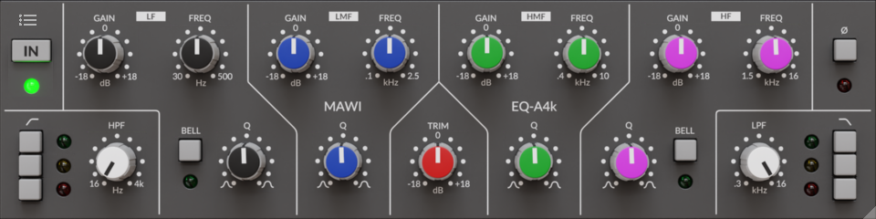
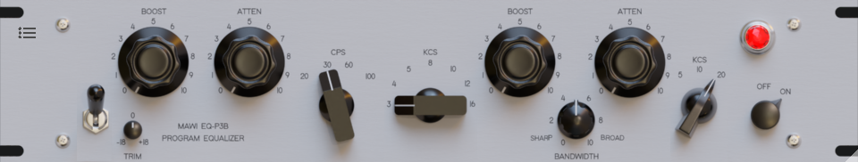

# mawi JSFX repository

This is a collection of JS effects I developed. Inspired by some JSFX with a GUI I had the idea to develop my own JSFX with a GUI.

The only problem was that I had never programmed before. I heard that JSFX is good for beginners. :) So I plunged into the project to learn programming. After many tries, failures and tests I would like to share my first effects with own GUI for free.  

---
## EQ-A4k

### Fully parametric analog EQ

The EQ-A4k is based on a very well-known British analog EQ that has been used for countless productions. Some functions and extensions have been added to the EQ-A4k to make it even more universally applicable. 

The highlight at a glance:
* analog hardware as model
* digital filters without distortion (decramped filters)
* 4 EQ bands, 3 HP and 3 LP filters
* low CPU, 0 latency, optimal for recording
* no noise or harmonic distortion, ideal for mixing and mastering
* attractive GUI, freely scalable
* fully automatable with sample accurate automation
* automatic bypass when playback stops 
* open source code, i.e. modifiable
* freeware, no annoying activation
* JSFX is optimally integrated in REAPER

---
## EQ-P3B

### Vintage passive EQ

The EQ-P3B is modeled on a legendary passive equalizer developed in the 1950s. It is one of the most appreciated and iconic equalizers in audio production and has had a great influence on the sound design of many music productions. Some functions have been changed to the EQ-P3B to make it even more universally applicable. 

The highlight at a glance:
* analog hardware as model
* simultaneous frequency boosts and cuts
* vintage flair with rich and harmonically pleasing sound
* low CPU, 0 latency, optimal for recording
* no noise, ideal for mixing and mastering
* attractive GUI, freely scalable
* fully automatable with sample accurate automation
* automatic bypass when playback stops 
* open source code, i.e. modifiable
* freeware, no annoying activation
* JSFX is optimally integrated in REAPER

---
Known issues:
 * Writing automations in touch mode does not work properly.
 * When sample accurate automation is on in EQ-P3B, buttons behave weird.

I am very grateful for any solutions.

**Thanks to** Tale, ErBird, Zeno, SaulT, Tukan_Studios, sai'ke, mrelwood, SonicAnomaly, geraintluff, BellesOndes, witti and all the great JSFX developers I forgot. Thanks also to all who helped me in the forum.

Please don't be shy and tell me any criticism, bugs, improvements or wishes. With a little luck I will fix these bugs and implement improvements or wishes.
You may support me. About **donations** I am glad. Paypal: mawi01@mail.de